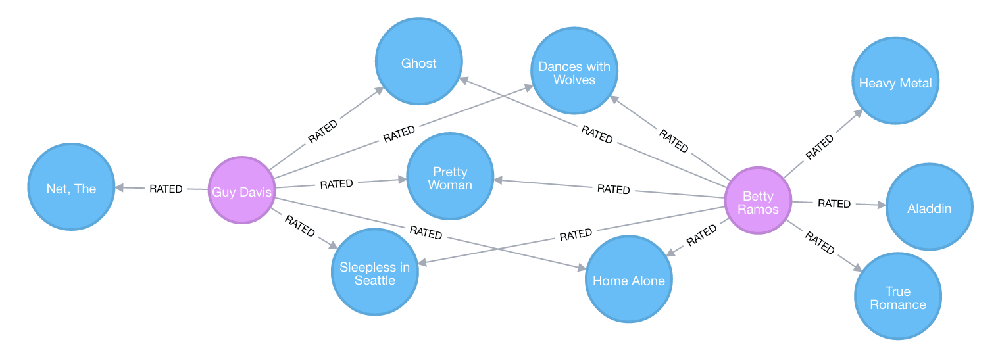

# Neo4j simple project for starting
under the docker folder, run the next command to execute the neo4j instance: 
```
sh runNeo4j.sh
```

run the index.js to run the main program:
```
node run index.js 
```


# Operations Manual
https://neo4j.com/docs/operations-manual/current/introduction/